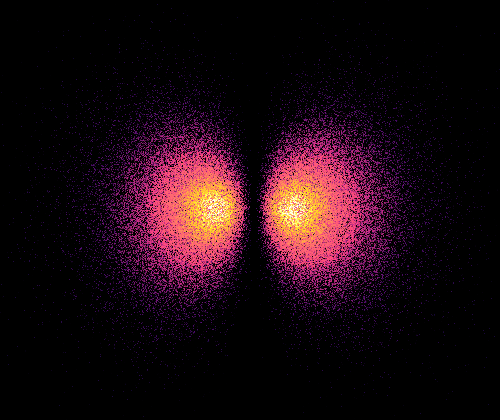
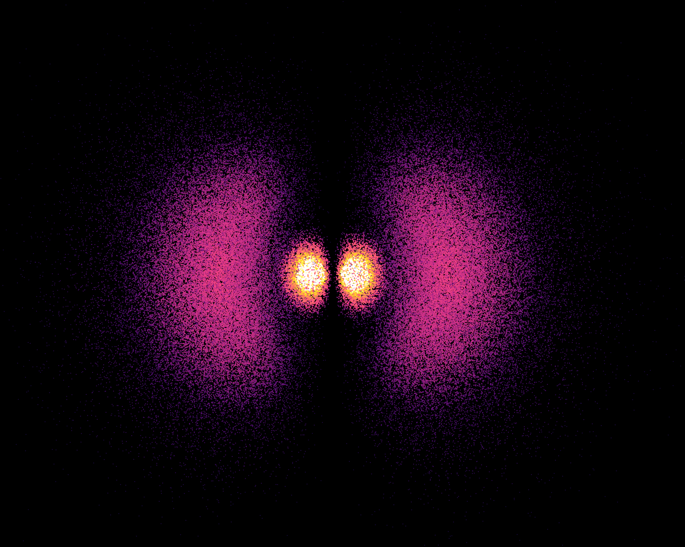

# Hydrogen Orbital Simulator

## About

`hydrogen-atom` is a C++ visualization for exploring hydrogen electron orbitals. The main application renders the orbital probability density as a 3D point cloud using OpenGL, and exposes quantum-number controls through Dear ImGui so you can switch between complex and real orbital bases, adjust `n`, `l`, and `m`, and inspect the resulting shape interactively.

## Examples

### Example 1

### Example 2

## Folder Overview

- `hydrogen/src/` contains the OpenGL application, UI logic, orbital math, and particle sampling code.
- `hydrogen/CMakeLists.txt` defines the native build and links GLFW, GLEW, GLM, OpenGL, and ImGui.
- `hydrogen/shaders/` contains standalone shader files; the current executable compiles shader source embedded in `src/main.cpp`.
- `hydrogen/build/` is a local build output directory with generated CMake files and the compiled binary.
- `test/` contains Python prototypes for validating or plotting hydrogen wavefunction math outside the C++ app.
- `third_party/imgui/` is the Dear ImGui submodule used for the in-app controls.
